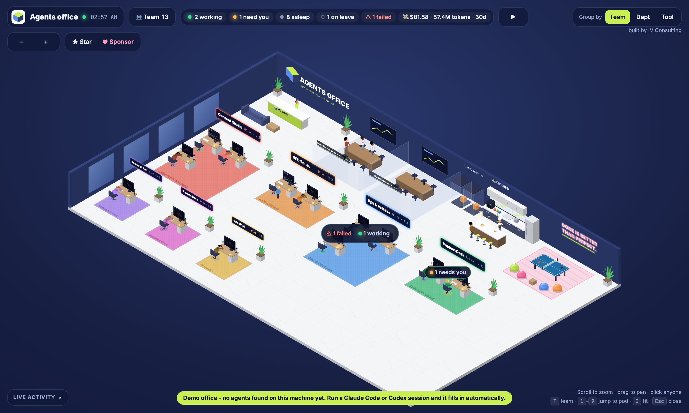
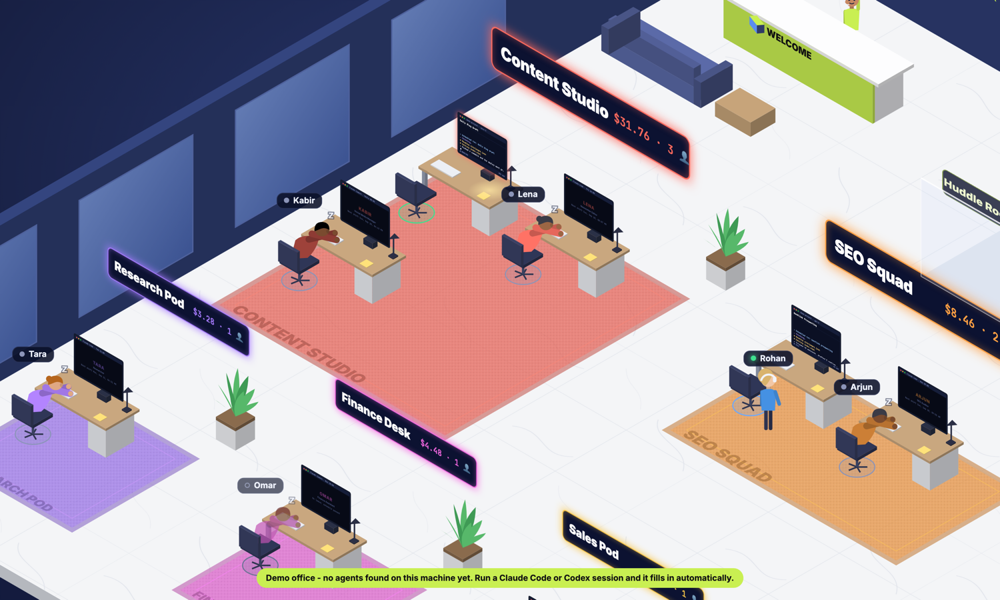
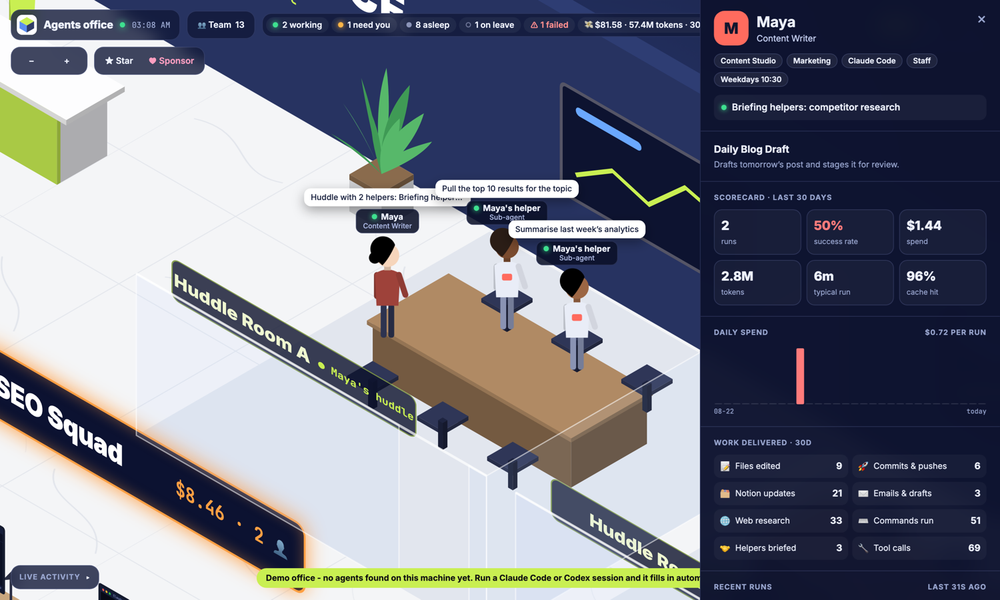
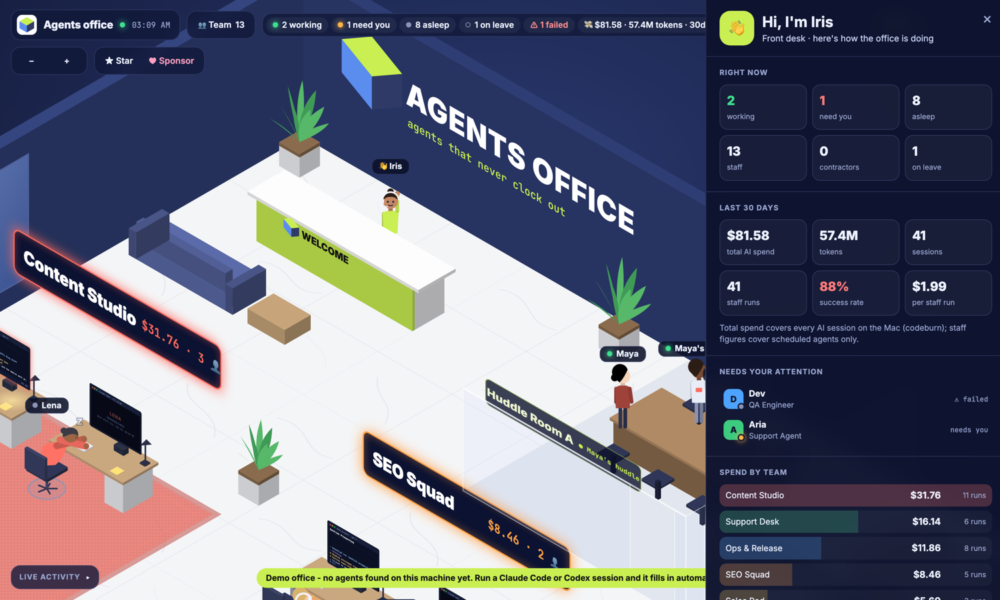
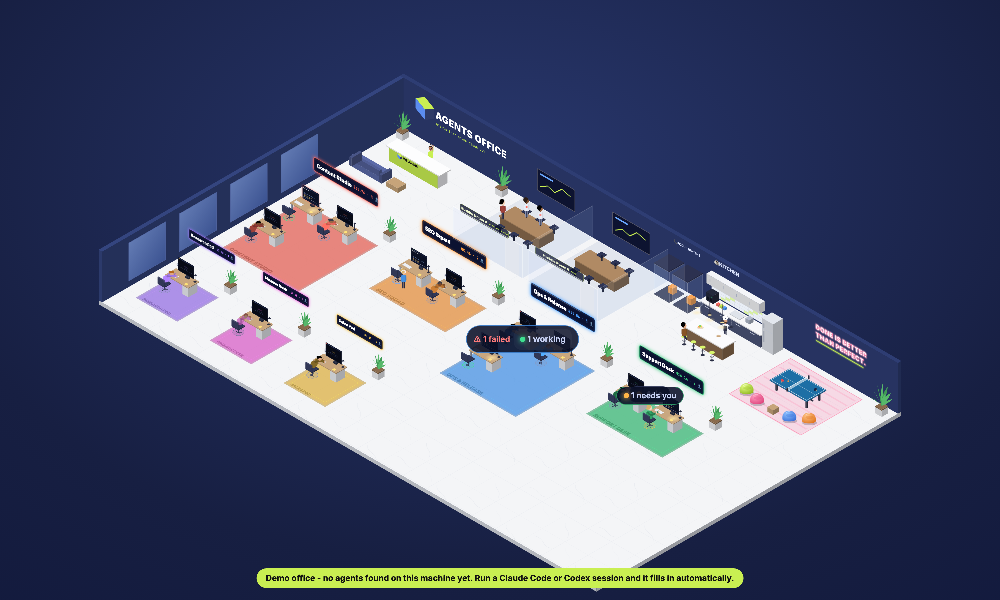

<div align="center">


# virtual agents office

### Your AI agents, as an office you can walk around.

[](LICENSE)
[](https://nodejs.org)
[](package.json)
[](https://github.com/IshanVats-6/virtual-agents-office/stargazers)

```bash
npx github:IshanVats-6/virtual-agents-office
```

**One command.** It reads this machine, opens `localhost:4747`, and there's your team.



</div>

---

Your scheduled agents stop being cron lines in a config file and become people at desks.

They **type while they run**, **sleep heads-down between shifts**, **huddle in a meeting room** when they spawn sub-agents, **walk over to another agent** when they hand off work, and **take a coffee break** when a run finishes. Click anyone and you get a 30-day scorecard: runs, success rate, spend, tokens, and what they actually shipped.

<table>
<tr>
<td width="50%"><br><em>Asleep between shifts, with the next run on the monitor.</em></td>
<td width="50%"><br><em>Click anyone: cost, success rate, work delivered, recent runs.</em></td>
</tr>
<tr>
<td width="50%"><br><em>Ask the receptionist how the company is doing.</em></td>
<td width="50%"><br><em>Kitchen, lounge, huddle rooms, focus booths.</em></td>
</tr>
</table>

## Quick start

```bash
npx github:IshanVats-6/virtual-agents-office     # run it
npx github:IshanVats-6/virtual-agents-office --demo   # a staged office, if yours is quiet
```

Or clone it:

```bash
git clone https://github.com/IshanVats-6/virtual-agents-office
cd virtual-agents-office && npm start
```

Node 18+ is the only requirement. No install step, no build, no dependencies, no account.

## Which tools it reads

Everything is read **locally and read-only**. Nothing is uploaded and there is no telemetry.

**Read directly, with live activity:** these agents move around the office in real time, show what they are doing right now, huddle with their sub-agents and flag approvals that are waiting on you.

| Tool | What it gives you |
|---|---|
| **Claude Code** | Live activity, scheduled tasks, sub-agent huddles, approvals waiting on you, cost and work delivered |
| **Codex** | Live activity, automations and their schedules, cost and work delivered |
| **Claude Cowork** | Scheduled tasks and their run history |
| **OpenClaw** | The always-on agent and whether its gateway is up |
| **Hermes** (optional, over SSH) | An always-on chat agent running on a remote box |

**Read through [codeburn](https://github.com/getagentseal/codeburn):** install it (`npm i -g codeburn`) and each of these gets a desk with a 30-day scorecard of runs, cost, tokens and cache hit. No live feed, since these tools do not keep one on disk in a readable shape.

| Tool | | Tool | | Tool |
|---|---|---|---|---|
| **Cursor** | | **GitHub Copilot** | | **Gemini CLI** |
| **Cursor Agent** | | **Cline** | | **Roo Code** |
| **Grok Build** | | **Grokbot** | | **Devin** |
| **Zed** | | **Warp** | | **OpenCode** |
| **Droid** | | **Kiro** | | **Goose** |
| **Qwen** | | **Kimi** | | **Crush** |
| **KiloCode** | | **Codebuff** | | **CodeWhale** |
| **Mistral Vibe** | | **Forge** | | **Antigravity** |
| **IBM Bob** | | **LingTai TUI** | | **Mux** |
| **OMP** | | **Pi** | | **ZCode** |
| **Open Design** | | **Vercel AI Gateway** | | and whatever codeburn adds next |

**Cloud-only agents** such as Manus keep no local history, so they cannot be shown yet. If your tool is missing, [open an issue](https://github.com/IshanVats-6/virtual-agents-office/issues/new) with where it stores its history.

**Found nothing?** You get a demo office with a banner, so the first run still shows you what this is.

## What you're looking at

- **Staff** are your standing agents (scheduled tasks and automations). One desk each, permanently, whether they're running or not.
- **Contractors** are one-off interactive sessions from the last 24 hours, at hot desks.
- **Status:** working · needs you (a tool is waiting for approval, or a question was asked) · on break · asleep, with the next shift on the monitor · on leave (schedule paused) · ⚠ last run failed.
- **Grouping:** by Team, Department or Tool. Departments and tools become wings that hold their team pods.
- **Scorecards:** runs, success rate, spend, tokens, typical run time, cache hit, a daily chart, work delivered (files edited, commits, Notion updates, email drafts, web research, commands, sub-agents briefed) and recent runs with the outcome of each.
- **Receptionist:** click her for headcount, 30-day spend, spend by team, who needs attention and what runs next.

Scroll to zoom, drag to pan, `T` for the team directory, `1`-`9` to jump to a pod, `▶` to stage a busy office.

## How agents get names, roles and teams

You never have to configure anything. Every agent is labelled from what is already in your task, in this order:

| Priority | Source | Example |
|---|---|---|
| 1 | **`office.json`** in this folder, written by `--label` or by hand | `{"tasks":{"weekly-seo-audit":{"role":"SEO Auditor","team":"Growth","dept":"Marketing"}}}` |
| 2 | **Frontmatter in your own task file** | `office_role: SEO Auditor` / `office_team: Growth` / `office_dept: Marketing` / `office_name: Ada` in the task's `SKILL.md` |
| 3 | **Keywords in the task id** | `weekly-seo-audit` gives the job title SEO Specialist and the department Marketing |
| 4 | **Keywords in the task description** | `run-weekly-thing` whose description says "weekly SEO audit of the marketing site" still lands in Marketing |
| 5 | **A prefix in the task title** | `Marketing \| Daily blog` puts that agent in Marketing whatever the id says |
| 6 | **Fallback** | The job title becomes the task name, and the department becomes "Agents" |

The person's **name** comes from a stable hash of the task id, so an agent keeps the same name forever. Pin one with `office_name`, `office.json` or `nameOverrides` in your config.

### Let an AI name them for you

```bash
npx github:IshanVats-6/virtual-agents-office --label
```

It reads the title and description of every scheduled agent you have, asks an AI CLI you already have installed (Claude Code, Codex or Gemini, whichever it finds first) for a job title, department and team for each, and writes `office.json`. You can edit that file afterwards; it wins over every guess.

No CLI installed? `--label --print` prints the prompt so you can paste it into any assistant and save the answer yourself.

```bash
cp config.example.json config.json    # or tune the guessing rules yourself
```

`company`, `tagline`, `teams`, `roles`, `deptKeywords`, `departments`, `nameOverrides`, `port`, `analyticsDays`, `maxContractors`, `bridgeOtherTools`.

### Next run times for Claude Code tasks

Claude Code keeps cron times in its scheduler rather than a file, so those agents show "Scheduled" with no countdown. To fill it in, ask Claude Code:

> list my scheduled tasks and write them to `schedules.json` here as `{"tasks":[{"id","title","cron","enabled"}]}`

Codex and Cowork schedules are read live and always show a next run.

## Reach it from anywhere (optional)

The same server also runs as a **relay**: your machine keeps reading logs and pushes the office to a small server you can open from your phone, behind a password.

```bash
# on the server
OFFICE_MODE=relay HOST=0.0.0.0 OFFICE_PASSWORD='…' PUSH_TOKEN='…' node server.mjs
# on your machine
PUSH_URL=https://office.example.com/api/push PUSH_TOKEN='…' node start.mjs
```

`Dockerfile`, `docker-compose.yml` and launchd/systemd units are in [docs/remote.md](docs/remote.md).

## Privacy

The activity feed contains **your real prompts, file paths and commands**.

- The local server binds to `127.0.0.1` only.
- The relay refuses every request without a password, and only accepts pushes carrying a bearer token.
- `"privacy": { "hideFeed": true }` in `config.json` strips prompt and reply text, keeping only tool names.
- `config.json`, `schedules.json` and the analytics cache are git-ignored.
- The only thing this project ever asks of your GitHub account is a star, once, with a yes/no prompt. Nothing is starred silently.

## How it works

```
start.mjs      detect sources, serve, open the browser
server.mjs     collectors + roster + HTTP/SSE  (or relay mode)
analytics.mjs  parses each run once (cached), merges codeburn cost data
demo.mjs       the staged office for first runs
public/        the whole isometric office in one file, no build step
```

Adding a source means returning sessions in the shape the collectors already use (`tool, sid, title, start, end, status, feed…`). `collectClaude` in `server.mjs` is the smallest example. Issues and PRs welcome.

## Who builds this

Hi, I'm **Ishan**. I write code for fun at hours that my calendar does not approve of, and this office is what happened when I wanted to see what my agents were doing while I slept. If it made you smile, that is the whole point.

Things I am building:

- **[HuddleOwl](https://huddleowl.com)** - an AI meeting coach that runs on your laptop. Nothing joins the call, and it is free.
- **[Mero](https://withmero.com)** - the Cursor for product management. It finds the features your customers are already asking for, hidden inside your own tech stack.
- **[virtual agents office](https://github.com/IshanVats-6/virtual-agents-office)** - this thing. Your agents, as an office you can walk around.
- **[IV Consulting](https://ivconsulting.in/?source=virtual-agents-office)** - where I help companies put AI agents into production instead of into slide decks.

## Support this

If it made you smile, [**star the repo**](https://github.com/IshanVats-6/virtual-agents-office) so other people find it, and tell me which tool you want supported next.

Sponsoring pays for the late nights, the domains, and the tokens these agents happily burn. Any amount is a genuine kick.

[](https://github.com/sponsors/IshanVats-6)

Built by [IV Consulting](https://ivconsulting.in/?source=virtual-agents-office). MIT licensed, so use it however you like.
